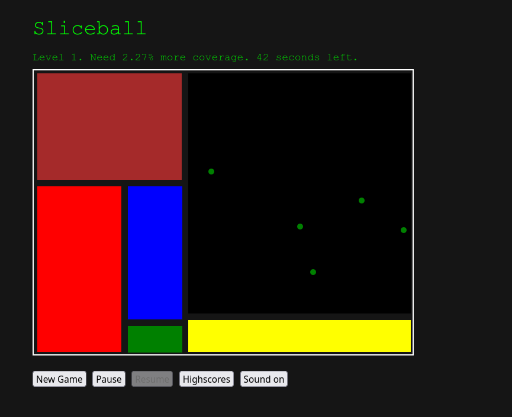

# Sliceball

A small game written by hand in JavaScript. Not the prettiest code, but somewhat fun to play.

The objective of the game is to fill out more of the board with colorful rectangles by "shooting" lines. Lines will alternate between being vertical and horizontal.

If a created line hits a ball, or if the player runs out of time, then the game is over.

Balls may teleport from time to time.

## Screenshot

## General info

* Version: 1.0.0
* License: BSD-3
